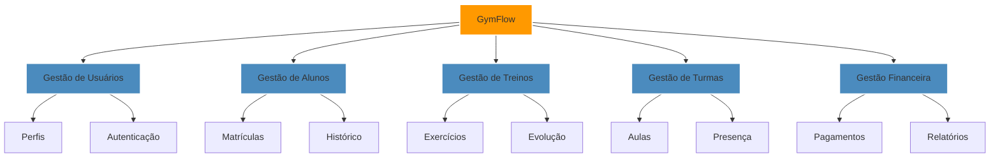
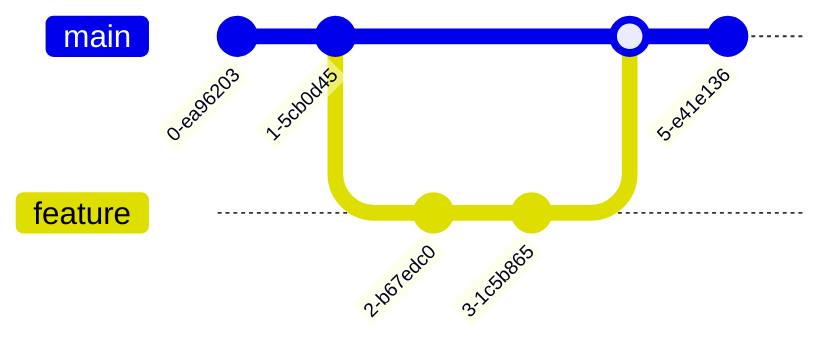

<div align="center">

```
 ▄████  ▄██   ▄   ▄▄▄▄███▄▄▄▄      ▄████████  ▄█        ▄██████▄   ▄█     █▄  
███    ███   ██▄ ▄██▀▀▀███▀▀▀██▄   ███    ███ ███       ███    ███ ███     ███ 
███    ███▄   ███▄███   ███   ███   ███    █▀  ███       ███    ███ ███     ███ 
███    ▀▀▀▀   ███▀███   ███   ███  ▄███▄▄▄     ███       ███    ███ ███     ███ 
███        ▄███▀███   ███   ███ ▀▀███▀▀▀     ███       ███    ███ ███     ███ 
███    █▄  ███   ███   ███   ███   ███    █▄  ███       ███    ███ ███     ███ 
███    ███ ███   ███   ███   ███   ███    ███ ███▌    ▄ ███    ███ ███ ▄█▄ ███ 
████████▀  ███   ███   ███   █▀    ██████████ █████▄▄██  ▀██████▀   ▀███▀███▀  
```

<h3>🏋️‍♂️ Sistema Inteligente de Gestão para Academias</h3>

[](https://www.python.org/)
[](https://getbootstrap.com/)
[](https://www.sqlite.org/)
[](LICENSE)

[📋 Sobre](#-sobre) • 
[💪 Recursos](#-recursos) • 
[🛠️ Tecnologias](#️-tecnologias) • 
[🚀 Instalação](#-instalação) • 
[📱 Demo](#-demo)

</div>

## 📋 Sobre

<div align="center">



</div>

## 💪 Recursos

<table align="center">
  <tr>
    <td align="center" width="33%">
      
      <br/><strong>Gestão de Alunos</strong>
      <br/>Sistema completo de cadastro e acompanhamento
      <br/>
      <sub>• Fichas completas<br/>• Evolução física<br/>• Histórico de treinos</sub>
    </td>
    <td align="center" width="33%">
      
      <br/><strong>Gestão de Treinos</strong>
      <br/>Planejamento e acompanhamento de treinos
      <br/>
      <sub>• Exercícios personalizados<br/>• Séries adaptativas<br/>• Métricas de progresso</sub>
    </td>
    <td align="center" width="33%">
      
      <br/><strong>Gestão Financeira</strong>
      <br/>Controle completo de pagamentos
      <br/>
      <sub>• Mensalidades<br/>• Relatórios detalhados<br/>• Controle de inadimplência</sub>
    </td>
  </tr>
</table>

## 🛠️ Stack Tecnológica

<div align="center">

| Back-end | Front-end | Database | DevOps |
|----------|-----------|----------|---------|
|  |  |  |  |
|  |  |  |  |

</div>

## 🚀 Instalação

<details>
<summary>💻 Instalação Local</summary>

```bash
# Clone o repositório
git clone https://github.com/seu-usuario/gymflow.git && cd gymflow

# Configure o ambiente virtual
python -m venv venv
source venv/bin/activate  # Linux/Mac
venv\Scripts\activate     # Windows

# Instale as dependências
pip install -r requirements.txt

# Configure o ambiente
cp .env.example .env

# Inicialize o banco
flask db upgrade
```
</details>

<details>
<summary>☁️ GitHub Codespaces</summary>

```bash
# Inicie diretamente com
python run.py
```
</details>

## 🔐 Acessos

<div align="center">

| Perfil | Credenciais | Permissões |
|--------|-------------|------------|
| 🎖️ **Admin** | admin@gymflow.com<br>admin123 | Acesso total |
| 💪 **Professor** | prof@gymflow.com<br>prof123 | Treinos e alunos |
| 📋 **Recepção** | recepcao@gymflow.com<br>recepcao123 | Cadastros e pagamentos |

</div>

## 📂 Estrutura

```plaintext
🏋️ GymFlow/
├── 🎯 backend/
│   ├── 📊 models/
│   ├── 🛣️ routes/
│   └── ⚙️ utils/
├── 🎨 frontend/
│   ├── 📱 assets/
│   └── 📄 templates/
├── 🔒 config/
└── 📚 docs/
```

## 🤝 Contribuição



1. Fork
2. Branch (`git checkout -b feature/NewFeature`)
3. Commit (`git commit -m 'Add: nova feature'`)
4. Push (`git push origin feature/NewFeature`)
5. PR

## 👨‍💻 Autor

<div align="center">
  
  <h3>Kelvin Moraes</h3>
  <p>Full Stack Developer | Fitness Enthusiast</p>
  
[](https://github.com/KerubinDev)
[](mailto:kelvin.moraes117@gmail.com)
</div>

---

<div align="center">
  
  **[⬆ Voltar ao topo](#gymflow---sistema-de-gestão-para-academias)**
  
  <sub>Desenvolvido com 💪 por Kelvin Moraes</sub>
  
[](https://github.com/KerubinDev/GymFlow)
</div>
